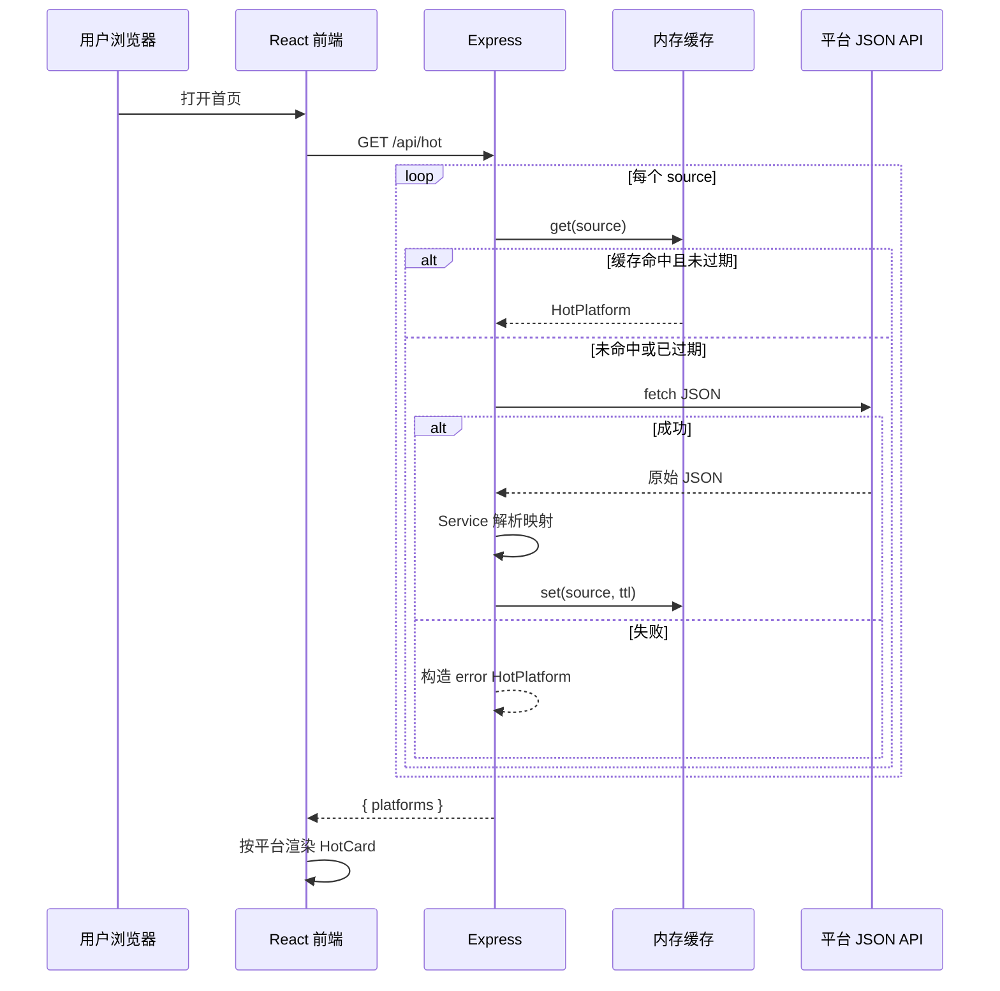

# 今日热搜 · 技术设计

> 与 [RESEARCH.md](./RESEARCH.md)、[PRD.md](./PRD.md) 配套。前后端共享同一套 TypeScript 类型定义。

## 技术栈

| 层级 | 选型 | 说明 |
|------|------|------|
| 前端 | React + TypeScript + Vite + CSS | 可用 CSS Modules，不强制 UI 库 |
| 后端 | Node.js + Express + TypeScript | 业务逻辑写在 Service，Route 只做转发 |
| 数据 | 各平台公开 JSON 接口 | `fetch` 解析，非 HTML 爬虫 |
| 缓存 | 内存 `Map` | TTL 默认 600 秒，范围 300～600 秒 |
| 部署 | Vercel（前端）/ Railway（后端） | 示例方案，可替换为任意静态托管 + Node 服务 |

## 项目结构

```text
mini-hot-hub/
├── client/                      # Vite + React
│   ├── src/
│   │   ├── components/          # Layout、HotCard、HotList
│   │   ├── api/                 # fetchHot、fetchAllHot
│   │   ├── types/               # 与 server 对齐（可 symlink 或复制）
│   │   ├── mock/                # 仅开发初期 / 单测使用
│   │   ├── App.tsx
│   │   └── main.tsx
│   ├── vite.config.ts           # /api 开发代理
│   └── package.json
├── server/
│   ├── src/
│   │   ├── routes/
│   │   │   └── hot.ts           # GET /api/hot、/api/hot/:source
│   │   ├── services/            # 各平台拉取与解析
│   │   │   ├── weibo.ts
│   │   │   ├── zhihu.ts
│   │   │   ├── bilibili.ts
│   │   │   └── index.ts         # 注册 source → fetcher 映射
│   │   ├── utils/
│   │   │   └── cache.ts         # TTL 内存缓存
│   │   ├── types/
│   │   │   └── hot.ts           # HotItem、HotPlatform（权威定义）
│   │   └── index.ts             # Express 入口
│   ├── package.json
│   └── tsconfig.json
├── RESEARCH.md
├── PRD.md
├── TECH_DESIGN.md
└── README.md
```

**分层约定**

- `routes/`：参数校验、调用 Service、组装 HTTP 响应，不写解析逻辑
- `services/`：上游请求、字段映射、错误包装
- `utils/cache.ts`：按 `source` 键缓存完整 `HotPlatform` 对象

## 数据模型

### HotItem

| 字段 | 类型 | 必填 | 说明 |
|------|------|------|------|
| `rank` | `number` | 是 | 从 1 开始 |
| `title` | `string` | 是 | 展示标题 |
| `url` | `string` | 是 | 跳转链接（绝对 URL） |
| `heat` | `string` | 否 | 热度文案，如「123 万」 |

```ts
interface HotItem {
  rank: number;
  title: string;
  url: string;
  heat?: string;
}
```

### HotPlatform（API 响应单元）

| 字段 | 类型 | 必填 | 说明 |
|------|------|------|------|
| `source` | `string` | 是 | `weibo` \| `zhihu` \| `bilibili` |
| `sourceName` | `string` | 是 | 展示名，如「微博」 |
| `listName` | `string` | 是 | 榜单名，如「热搜榜」 |
| `updatedAt` | `string` | 是 | ISO 8601，本次数据时间 |
| `items` | `HotItem[]` | 是 | 成功时 ≥10 条（目标） |
| `error` | `boolean` | 否 | `true` 表示该平台失败 |
| `message` | `string` | 否 | 失败原因，供卡片展示 |

```ts
type HotSource = 'weibo' | 'zhihu' | 'bilibili';

interface HotPlatform {
  source: HotSource;
  sourceName: string;
  listName: string;
  updatedAt: string;
  items: HotItem[];
  error?: boolean;
  message?: string;
}
```

### 聚合响应

首页一次拉取全部平台时使用：

```ts
interface HotAggregateResponse {
  platforms: HotPlatform[];
}
```

## API 设计

| 方法 | 路径 | 说明 |
|------|------|------|
| `GET` | `/api/hot` | 返回全部已启用平台，`platforms[]` |
| `GET` | `/api/hot/:source` | 返回单个平台，`source` 非法时 `404` |
| `GET` | `/api/health` | 健康检查，部署探活用 |

**成功示例**（`GET /api/hot/weibo`）

```json
{
  "source": "weibo",
  "sourceName": "微博",
  "listName": "热搜榜",
  "updatedAt": "2026-06-25T08:00:00.000Z",
  "items": [
    { "rank": 1, "title": "示例词条", "heat": "123万", "url": "https://..." }
  ]
}
```

**失败示例**（单平台异常，HTTP 仍 `200`，由前端读 `error`）

```json
{
  "source": "weibo",
  "sourceName": "微博",
  "listName": "热搜榜",
  "updatedAt": "2026-06-25T08:00:00.000Z",
  "items": [],
  "error": true,
  "message": "上游接口暂时不可用"
}
```

**约定**

- 前端只请求本站 `/api/*`，禁止直连微博 / 知乎 / B 站域名
- 多平台聚合时各平台并行请求，单路失败不影响其他路

## 核心流程



1. 用户打开首页 → 前端 `GET /api/hot`
2. 后端按 `source` 查缓存 → 未命中则 `fetch` 上游 JSON → Service 解析 → 写入缓存 → 返回
3. 前端将每个 `HotPlatform` 交给 `HotCard` + `HotList` 渲染
4. 某平台失败 → 该卡片进入 error 态，其余卡片正常展示

## 缓存策略

- **键**：`hot:${source}`（如 `hot:weibo`）
- **值**：完整 `HotPlatform` 对象
- **TTL**：默认 `600` 秒，通过环境变量 `CACHE_TTL` 配置（建议 300～600）
- **过期**：读取时判断 `storedAt + ttl`，过期则重新拉取
- **击穿**：同一 `source` 在刷新窗口内多次请求只打一次上游（先查缓存再 fetch）
- **范围**：进程内内存；多实例部署时各实例独立缓存（学习项目可接受）

## 平台 Service 约定

每个平台一个文件，导出统一签名的 fetcher：

```ts
type PlatformFetcher = () => Promise<HotPlatform>;

// services/weibo.ts
export const fetchWeiboHot: PlatformFetcher = async () => { /* ... */ };
```

**公共要求**

- 设置合理 `User-Agent`、`Referer`（按各平台文档或实际调试结果）
- 请求超时建议 8～10 秒，超时视为失败
- 将上游字段映射为 `HotItem[]`，过滤无标题 / 无链接项
- 捕获异常，返回带 `error: true` 的 `HotPlatform`，不向上抛出导致整页 500

`services/index.ts` 维护注册表：

```ts
const fetchers: Record<HotSource, PlatformFetcher> = {
  weibo: fetchWeiboHot,
  zhihu: fetchZhihuHot,
  bilibili: fetchBilibiliHot,
};
```

## 开发环境

### 本地端口

- 前端：`5173`（Vite 默认）
- 后端：`3001`

### Vite 代理

`vite.config.ts` 将 `/api` 代理到 `http://localhost:3001`，前端代码统一写相对路径 `/api/hot`。

### 环境变量

| 变量 | 位置 | 默认值 | 说明 |
|------|------|--------|------|
| `CACHE_TTL` | server | `600` | 缓存秒数 |
| `PORT` | server | `3001` | 监听端口 |
| `VITE_API_BASE` | client | 空 | 生产后端根 URL；空则使用相对路径 |

`.env` 不入库；提供 `.env.example` 仅含变量名与说明。

## 前端组件职责

| 组件 | 职责 |
|------|------|
| `Layout` | 页头标题、响应式网格容器、页脚（学习项目 / 非商用） |
| `HotCard` | 单平台卡片：标题区、更新时间、loading / error / 列表态 |
| `HotList` | 渲染 `items`，排名 1～3 视觉强调，外链 `target="_blank"` |

**布局**：桌面 ≥3 列卡片网格，移动端 1 列（CSS Grid + media query）。

## 数据方案

| 方案 | 说明 |
|------|------|
| **主路线（推荐）** | 自建 Express Service 拉取各平台 JSON，零成本、可控 |
| **救急** | 免费第三方热搜 API，不稳定，仅短期兜底 |
| **不推荐** | 微博 OAuth（过重）、HTML 爬虫（易碎、合规风险） |

各平台具体接口 URL 与字段映射在实现阶段写入 `services/*.ts` 注释或 README，因上游可能变更，不在本文档写死地址。

## 部署示意

```text
用户 ──HTTPS──▶ Vercel（静态 client/dist）
                    │
                    │ VITE_API_BASE 或同域反代
                    ▼
              Railway（server Node 进程）
                    │
                    └── fetch ──▶ 微博 / 知乎 / B 站 JSON
```

- 前端构建：`cd client && npm run build`
- 后端启动：`cd server && npm run start`
- 配置 CORS：仅允许前端域名（生产环境收紧 `origin`）

## 错误与可观测性

- 上游失败：单平台 `error: true`，日志 `console.error` 记录 `source` 与简要原因
- 非法 `source`：`404` + `{ message: 'Unknown source' }`
- 健康检查：`GET /api/health` → `{ status: 'ok' }`

## 测试检查清单

与 PRD 对齐，实现后逐项手测：

- [ ] 每个平台返回 ≥10 条，字段完整（rank / title / url）
- [ ] 模拟单平台失败，其他卡片仍正常
- [ ] 10 分钟内多次刷新，上游请求次数符合缓存预期（可看日志或抓包）
- [ ] 移动端 1 列、桌面 3 列布局正常
- [ ] 页脚展示「学习项目 · 非商用」

## 后续可扩展（本期不做）

- Redis 共享缓存、定时预热
- 更多平台（抖音、百度等）仅需新增 `services/xxx.ts` 并注册
- 用户自定义显示平台顺序
